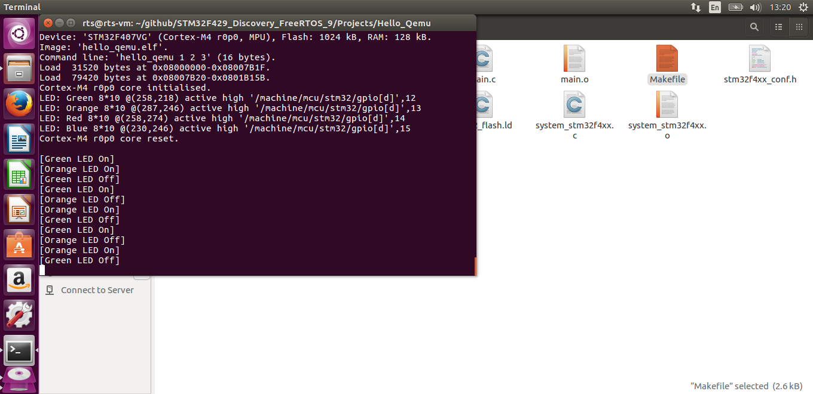

## 1. QEMU安装
  本例程使用qemu-system-gnuarmeclipse，该qemu分支对stm32f4有更好的支持，主要面向Eclipse开发环境，本文档给出在Ubuntu 16.04命令行环境下单独使用的方式。

- 到网页 https://github.com/gnu-mcu-eclipse/qemu/releases/tag/gae-2.7.0-20161128 下载二进制文件到~/work目录：
 gnuarmeclipse-qemu-debian64-2.7.0-201611282115-dev.tgz 
- 在工作目录解压缩文件

#cd ~/work
#tar xvf ~/Downloads/gnuarmeclipse-qemu-debian64-2.7.0-201611282115-dev.tgz
#chmod -R -w ./qemu

- 测试qemu能否正常运行

#qemu/2.7.0-201611282115-dev/bin/qemu-system-gnuarmeclipse --version

如正常则会显示版本信息。

## 2. 编译本例程

- 在Hello_Qemu目录下运行make，生成hello_qemu.elf文件

## 3. QEMU仿真

- 在Hello_Qemu目录下运行：

~/work/qemu/2.7.0-201611282115-dev/bin/qemu-system-gnuarmeclipse --verbose --verbose --board STM32F4-Discovery \
--mcu STM32F407VG -d unimp,guest_errors \
--nographic --image hello_qemu.elf \
--semihosting-config enable=on,target=native \
--semihosting-cmdline hello_qemu 1 2 3

> 参数含义参见： https://gnu-mcu-eclipse.github.io/qemu/options/
如正常运行则会显示LED的状态变化。如图所示：

 
 
